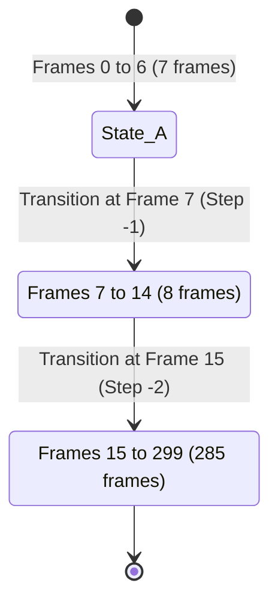
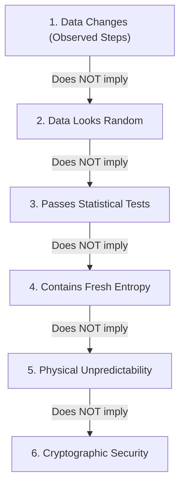
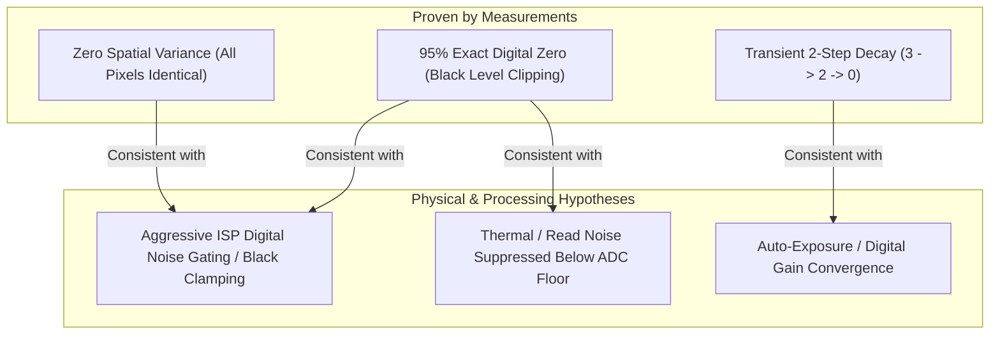

# Camera Noise Experiment — dark-001

## 1. Objective

The primary objective of this experiment is to characterize the natural baseline fluctuations present in the digital output of an integrated laptop camera sensor under dark (covered) conditions, evaluate its statistical and entropy properties using the project's analysis pipeline, and assess whether the resulting stochastic signal is suitable for downstream applications such as driving a quantum-circuit noise simulation or physical random-number generation.

The scientific framing of this study is strictly empirical: we do not claim or attempt to prove that consumer camera noise constitutes "quantum randomness" or cryptographic entropy. Rather, we treat the consumer camera system (lens, CMOS sensor, analog front-end, ADC, onboard image signal processor [ISP], driver, and host operating system capture stack) as a physical stochastic system and systematically measure what data it actually delivers.

---

## 2. Experimental Setup

The data-collection environment and software stack used for this experiment are documented below:

| Parameter | Recorded Value / Configuration |
|---|---|
| **Experiment Directory** | `experiments\20260828T193144+0530_camera0` |
| **Capture Timestamp (UTC)** | `2026-08-28T14:01:44.220896+00:00` to `2026-08-28T14:01:55.431444+00:00` |
| **Host System & OS** | Windows 11 (build 10.0.26200-SP0, AMD64) |
| **Python Version** | Python 3.12.7 (MSC v.1941 64-bit) |
| **Core Libraries** | OpenCV (`cv2`) 4.14.0, NumPy 2.2.6, SciPy 1.15.2, Matplotlib 3.10.1 |
| **Camera Index & Name** | Camera Index `0` (`Camera 0`) |
| **Capture Backend** | Windows Media Foundation (`MSMF`) |
| **Declared Dark Protocol** | False (captured under covered condition without `--dark` CLI flag) |
| **Software Verification of Cover** | Not possible via software; protocol relies on physical occlusion |

---

## 3. Dataset Validation

The raw session directory was inspected and validated directly from disk prior to statistical interpretation.

### 3.1 Storage Files and Integrity

The capture directory contains three uncompressed, lossless artifacts:

1. `frames.npy` (829,440,128 bytes): Uncompressed NumPy 4D array of shape `(300, 720, 1280, 3)` with `uint8` data type in standard OpenCV `BGR` color order.
2. `timestamps.npy` (14,720 bytes): Structured NumPy array containing 300 records with 6 timing fields (`frame_index`, `capture_start_monotonic_ns`, `capture_end_monotonic_ns`, `capture_end_utc_ns`, `source_timestamp_ms`, `source_frame_position`).
3. `metadata.json` (5,020 bytes): Complete capture context, driver property readbacks, dropped-frame diagnostics, and system configuration.

### 3.2 Dataset Completeness and Analyzability

* **Requested Frames:** 300
* **Valid Stored Frames:** 300 (100% complete file allocation)
* **Read Failures:** 0 (no read errors returned by OpenCV during acquisition)
* **Analyzability:** Complete and fully analyzable by all automated analysis modules.

### 3.3 Timing and Host Delivery Irregularities

Analysis of the monotonic clock deltas ($\Delta t = t_{i} - t_{i-1}$) reveals severe timing irregularity caused by the interaction of the Windows MSMF driver buffer and the host polling loop:

| Timing Metric | Measured Value |
|---|---|
| **Total Monotonic Duration** | 9.9028 seconds |
| **Nominal Frame Rate** | 30.0 fps ($\Delta t_{\text{nominal}} = 33.33\text{ ms}$) |
| **Minimum Interval** | 2.90 ms |
| **Median Interval** | 4.46 ms |
| **Mean Interval** | 33.12 ms |
| **Maximum Interval** | 122.16 ms |
| **Interval Standard Deviation** | 48.33 ms |
| **Host Timing Gaps ($>40\text{ ms}$)** | 79 gaps |
| **Estimated Missed Frame Intervals** | 192 intervals |

#### Observation
The median frame interval is 4.46 ms (far shorter than the 33.3 ms camera frame interval), interspersed with 79 large gaps of up to 122.16 ms.

#### Interpretation
The capture loop polled and retrieved frames from the MSMF pipeline in rapid bursts whenever driver buffers were flushed, rather than receiving frames synchronously at a steady hardware cadence.

#### Alternative Explanation
The operating system thread scheduler experienced periodic preemption, or the camera driver internal pipeline delivered cached identical frames during frame grabs.

---

## 4. Camera Configuration

The capture requested manual exposure and white-balance locking to suppress automated camera gain/exposure control loops:

| Property | Requested Setting | Readback Value | Driver Status | Detail / Note |
|---|---|---|---|---|
| **Frame Width** | 1280 | 1280.0 | Accepted | Changed from default 640.0 |
| **Frame Height** | 720 | 720.0 | Accepted | Maintained at 720.0 |
| **Auto-Exposure** | `manual/off` | 0.0 | Accepted | Driver accepted manual mode switch |
| **Exposure Value** | Default (unspecified) | -6.0 | Reported | Log-scale exposure time index ($2^{-6}\text{ s} \approx 15.6\text{ ms}$) |
| **Auto-White-Balance** | 0.0 (off) | -1.0 | **Rejected** | Property not supported by MSMF driver |
| **Gain Control** | Default (unspecified) | -1.0 | **Unsupported** | OpenCV exposes no portable manual gain switch |
| **Warmup Frames** | 5 | N/A | Completed | 5 frames discarded prior to recording |

### Driver Warnings
1. *Gain Control Warning:* OpenCV has no portable auto-gain switch. Gain may still be automatic; provide `--gain` to request and verify a fixed value where supported.
2. *White-Balance Rejection:* Camera setting `auto_white_balance` was rejected; requested=0.0, readback=-1.0.
3. *Timing Warning:* Host timing gaps suggest one or more capture intervals may have been missed.

---

## 5. Observed Signal

Direct inspection of all 829,440,000 stored values across the 300 frames reveals a stark, definitive finding: **the signal is almost entirely digitized to zero with zero spatial variation across all frames.**

### 5.1 Frame-by-Frame Structure

The entire 300-frame recording decomposes into exactly **three discrete states**:

| Frame Range | Frame Count | Duration (approx.) | Channel B | Channel G | Channel R | Spatial Variance |
|---|---|---|---|---|---|---|
| **Frames 0 – 6** | 7 frames | $\sim 0.23\text{ s}$ | All pixels = **3** | All pixels = **3** | All pixels = **3** | $\sigma^2_{\text{spatial}} = 0.0$ |
| **Frames 7 – 14** | 8 frames | $\sim 0.27\text{ s}$ | All pixels = **2** | All pixels = **2** | All pixels = **2** | $\sigma^2_{\text{spatial}} = 0.0$ |
| **Frames 15 – 299** | 285 frames | $\sim 9.40\text{ s}$ | All pixels = **0** | All pixels = **0** | All pixels = **0** | $\sigma^2_{\text{spatial}} = 0.0$ |

### 5.2 Signal Level Validation

* **Total Measurements per Channel:** $300 \times 720 \times 1280 = 276,480,000$ pixels.
* **Exact Value Population (All Channels B, G, R):**
  * Value `0`: $262,656,000$ pixels (**95.000%**)
  * Value `1`: $0$ pixels (**0.000%**)
  * Value `2`: $7,372,800$ pixels (**2.667%**)
  * Value `3`: $6,451,200$ pixels (**2.333%**)
  * Values `4` to `255`: $0$ pixels (**0.000%**)
* **Non-Zero Frame Transitions:** Exactly **2** in the entire recording (Frame 6 $\rightarrow$ 7: $-1$ LSB; Frame 14 $\rightarrow$ 15: $-2$ LSB).
* **Identical Consecutive Frames:** **297 out of 299 transitions (99.331%)**.

---

## 6. Statistical Analysis

Descriptive statistics across the full dataset ($N = 276,480,000$ samples per channel):

| Metric | Channel B | Channel G | Channel R | Combined Luma |
|---|---|---|---|---|
| **Sample Count ($N$)** | 276,480,000 | 276,480,000 | 276,480,000 | 276,480,000 |
| **Minimum Value** | 0.0 | 0.0 | 0.0 | 0.0 |
| **Maximum Value** | 3.0 | 3.0 | 3.0 | 3.0 |
| **Dynamic Range** | 3 levels ($0, 2, 3$) | 3 levels ($0, 2, 3$) | 3 levels ($0, 2, 3$) | 3 levels ($0.0, 2.0, 3.0$) |
| **Arithmetic Mean ($\mu$)** | 0.123333 | 0.123333 | 0.123333 | 0.123333 |
| **Median ($p_{50}$)** | 0.0 | 0.0 | 0.0 | 0.0 |
| **Standard Deviation ($\sigma$)** | 0.549050 | 0.549050 | 0.549050 | 0.549050 |
| **Variance ($\sigma^2$)** | 0.301456 | 0.301456 | 0.301456 | 0.301456 |
| **Percentile $p_{0.1} - p_{95}$** | 0.0 | 0.0 | 0.0 | 0.0 |
| **Percentile $p_{99}$** | 3.0 | 3.0 | 3.0 | 3.0 |
| **Low Clipping Fraction ($=0$)** | 0.950000 | 0.950000 | 0.950000 | 0.950000 |
| **High Saturation Fraction ($=255$)** | 0.000000 | 0.000000 | 0.000000 | 0.000000 |

### Observation
The mean is $0.1233$, with a standard deviation of $0.5491$, but 95% of all values are identically 0.

### Interpretation
The non-zero standard deviation does not represent continuous Gaussian noise. It is entirely an artifact of pooling the first 15 non-zero frames with the 285 zero frames.

### Alternative Explanation
A transient optical or electrical decay occurred during camera startup before reaching steady-state black clipping.

---

## 7. Temporal Analysis

### 7.1 Frame-to-Frame Differences and Stationarity

| Window | Frame Range | Elapsed Time (s) | Window Mean | Window Std Dev | Low Clipping Fraction |
|---|---|---|---|---|---|
| **Window 0** | Frames 0 – 59 | 0.00 – 1.90 s | 0.616667 | 1.096839 | 0.750000 |
| **Window 1** | Frames 60 – 119 | 2.00 – 3.90 s | 0.000000 | 0.000000 | 1.000000 |
| **Window 2** | Frames 120 – 179 | 4.02 – 5.91 s | 0.000000 | 0.000000 | 1.000000 |
| **Window 3** | Frames 180 – 239 | 6.02 – 7.90 s | 0.000000 | 0.000000 | 1.000000 |
| **Window 4** | Frames 240 – 299 | 8.02 – 9.90 s | 0.000000 | 0.000000 | 1.000000 |

* **First-to-Last Window Mean Change:** $-0.616667$
* **Linear Drift Rate:** $-0.070643\text{ LSB/s}$
* **Duplicate Consecutive Frames:** **297 / 299 (99.331%)**
* **Frame Difference RMS Median:** $0.000000$ (Max: $2.000000$)

### 7.2 Temporal Autocorrelation

The lag structure of sampled pixel time series demonstrates severe temporal dependence:

$$\rho(\tau) = \frac{\sum_{t} (x_t - \bar{x})(x_{t+\tau} - \bar{x})}{\sum_t (x_t - \bar{x})^2}$$

* $\rho(\text{Lag } 1) = 0.972320$
* $\rho(\text{Lag } 2) = 0.944641$
* $\rho(\text{Lag } 5) = 0.861601$
* $\rho(\text{Lag } 10) = 0.723203$
* $\rho(\text{Lag } 15) = 0.584805$

### 7.3 Spectral Analysis

FFT analysis of the detrended Hann-windowed ROI mean series reveals artificial low-frequency power concentrated below 1 Hz:
* **Primary Peak:** $0.7482\text{ Hz}$ (Power: $2.2019$)
* **Secondary Peak:** $1.4964\text{ Hz}$ (Power: $0.0787$)
* **Sample Rate:** $224.46\text{ Hz}$ (derived from median timestamp delta)

#### Meaning of Temporal Results
Each new frame **does NOT contain genuinely new information**. Once the camera settles after frame 14, consecutive frames are 100% redundant. Apparent temporal entropy is entirely an artifact of non-stationarity during the first 0.5 seconds.

---

## 8. Spatial Analysis

### 8.1 Neighboring Pixel Correlation

Spatial correlation was evaluated across all horizontal, vertical, and diagonal adjacent pairs:

| Measurement Plane | Pair Count Evaluated | Pearson Correlation ($r$) |
|---|---|---|
| **Raw Horizontal Neighbors ($x, x+1$)** | $276,096,000$ | **1.000000** |
| **Raw Vertical Neighbors ($y, y+1$)** | $276,096,000$ | **1.000000** |
| **Raw Diagonal Neighbors ($x+1, y+1$)** | $275,712,300$ | **1.000000** |
| **Fixed-Pattern Removed Residuals** | $276,096,000$ | **1.000000** |
| **Local Frame Residuals** | $276,096,000$ | **1.000000** |

### 8.2 Spatial Fixed-Pattern Analysis

* **Mean Image Spatial Standard Deviation:** $2.6368 \times 10^{-16} \approx 0.0000$
* **Row-Mean Standard Deviation:** $1.3878 \times 10^{-17} \approx 0.0000$
* **Column-Mean Standard Deviation:** $1.3878 \times 10^{-17} \approx 0.0000$
* **Fixed-Pattern to Temporal-Noise Ratio:** $4.8024 \times 10^{-16} \approx 0.0000$

### 8.3 Channel-to-Channel Correlation

Cross-correlation between color channels ($B, G, R$) is **identically 1.000000**:
* For every pixel $(x,y)$ at frame $t$: $B(x,y,t) = G(x,y,t) = R(x,y,t)$.

#### Spatial Conclusion
A sensor resolution of $1280 \times 720$ yields 921,600 pixels per frame, but **zero spatial degrees of freedom**. The camera ISP outputs a perfectly flat, uniform digital field. Pooling spatial pixels multiplies sample counts without adding independent information.

---

## 9. Entropy Analysis

### 9.1 Concept Disambiguation

To ensure rigorous scientific framing, the following concepts are strictly distinguished:

1. **The data changes:** Macroscopic steps (3 $\rightarrow$ 2 $\rightarrow$ 0) occurred during startup.
2. **The data looks random:** False. The data looks like a static step function with 95% zeros.
3. **The data passes statistical tests:** False. All statistical hypothesis tests fail with $p = 0.0000$.
4. **The data contains measurable entropy:** True only in the shallow mathematical sense that the sample variance is non-zero when transient frames are included ($H_{\text{Shannon}} = 0.1598\text{ bits/bit}$).
5. **The data is unpredictable:** False. A trivial lag-1 copy predictor predicts the held-out stream with 99.33% to 100% accuracy.
6. **The data is cryptographically secure:** False. It is completely unviable for security.

### 9.2 Continuous and Quantized Amplitude Metrics

Evaluated on a deterministic uniform grid of 3,333 spatial pixels tracked over 300 frames ($N = 999,900$ samples):

| Metric | Formula / Method | Measured Value | Interpretation |
|---|---|---|---|
| **Sample Alphabet Size** | Unique integer levels observed | 3 ($0, 2, 3$) | Extreme quantization / clipping |
| **Plugin Shannon Entropy** | $-\sum p_i \log_2 p_i$ | **0.159768 bits/symbol** | Naive estimate assuming IID |
| **Plugin Min-Entropy ($H_{\infty}$)** | $-\log_2(\max p_i)$ | **0.034062 bits/symbol** | Determined by $p(0) = 0.9767$ |
| **MCV Wilson Lower Bound (99%)** | $-\log_2(p_{\text{upper}})$ | **0.033547 bits/symbol** | Confidence-adjusted MCV |
| **Per-Pixel MCV Median Bound** | Median down time per pixel | **0.033547 bits/symbol** | Uniform across all pixels |
| **IID Collision Probability** | $\sum p_i^2$ | **0.954422** | Expected collision rate under IID |
| **Observed Adjacent Collision** | Fraction $x_t = x_{t+1}$ | **0.993334** | Strong excess memory ($> 99.3\%$) |
| **1st-Order Conditional Shannon** | $H(X_t \mid X_{t-1})$ | **0.001124 bits/symbol** | Collapses when conditioned on lag-1 |
| **Stationarity Shift Test** | $\chi^2$ test (1st half vs 2nd half) | $p < 10^{-300}$ (**Fail**) | Severe non-stationarity |
| **D'Agostino-Pearson Normality** | Normal distribution fit | $p = 0.000000$ (**Fail**) | Highly non-Gaussian |

---

## 10. Bit Extraction Comparison

Five bit extraction algorithms provided by the existing analysis module were evaluated against the dataset ($N_{\text{input}} = 999,900$ measurements):

| Extraction Method | Output Bits | Yield (bits/sample) | Bias ($p_1 - 0.5$) | Conservative $H_{\infty}$ (bits/bit) | Entropy Yield (bits/sample) | Selected Tests Status |
|---|---|---|---|---|---|---|
| `direct_value_lsb` | 999,900 | 1.0000 | $-0.4767$ | **0.009224** | **0.009224** | **Failed** ($p = 0.0000$) |
| `temporal_difference_parity` | 996,567 | 0.9967 | $-0.4967$ | **0.004639** | **0.004623** | **Failed** ($p = 0.0000$) |
| `per_pixel_median_threshold` | 499,950 | 0.5000 | $-0.5000$ | **0.000000** | **0.000000** | **Failed** ($p = 0.0000$) |
| `temporal_difference_sign` | 996,567 | 0.9967 | $-0.5000$ | **0.000000** | **0.000000** | **Failed** ($p = 0.0000$) |
| `direct_value_lsb_von_neumann` | 3,333 | 0.0033 | $+0.5000$ | **0.000000** | **0.000000** | **Failed** ($p = 0.0000$) |

### 10.1 Detailed Method Breakdown

1. **`direct_value_lsb` (Least Significant Bit):**
   * *Transformation:* Extracts bit 0 of each integer pixel value ($3 \rightarrow 1, 2 \rightarrow 0, 0 \rightarrow 0$).
   * *Outcome:* $23,331$ ones (2.33%) and $976,569$ zeros (97.67%).
   * *Quality:* Extreme bias. Fails monobit test ($p = 0.0$), block frequency test ($p = 0.0$), and runs test ($p = 0.0$, 6,666 runs vs 45,574 expected). Held-out lag-1 prediction accuracy is 99.33%.

2. **`temporal_difference_parity` (Difference Parity):**
   * *Transformation:* Parity of $|x_t - x_{t-1}|$.
   * *Outcome:* Emits 1 only at Frame 6 $\rightarrow$ 7 ($|2-3|=1$). Emits 0 for Frame 14 $\rightarrow$ 15 ($|0-2|=2$) and all static frames.
   * *Quality:* $3,333$ ones (0.33%) and $993,234$ zeros (99.67%). Near-total bias.

3. **`per_pixel_median_threshold` (Median Threshold):**
   * *Transformation:* Evaluates $x_t > \text{median}(x_{0..149})$ on second half ($t \ge 150$).
   * *Outcome:* First-half median is 0. All second-half frames are 0 ($0 > 0$ is False).
   * *Quality:* Emits $499,950$ consecutive zeros (100% zeros). Zero entropy.

4. **`temporal_difference_sign` (Difference Sign):**
   * *Transformation:* Emits 1 if $x_t - x_{t-1} > 0$, else 0.
   * *Outcome:* Both transitions are negative ($-1, -2$); all other frames are 0.
   * *Quality:* Emits $996,567$ consecutive zeros (100% zeros). Zero entropy.

5. **`direct_value_lsb_von_neumann` (Von Neumann Debiasing):**
   * *Transformation:* Groups LSBs into non-overlapping pairs $(b_{2k}, b_{2k+1})$; emits $b_{2k}$ if $01$ or $10$, discards $00$ and $11$.
   * *Outcome:* $00$ pairs discarded (99.67% of data); the only unequal pairs occur across the Frame 6 $\rightarrow$ 7 transition.
   * *Quality:* Emits $3,333$ identical ones (100% ones). Rejection rate is $99.67\%$, yet fails completely to produce entropy because input pairs violate the fundamental independence requirement.

---

## 11. Randomness Assessment

External randomness test suites (`ea_non_iid` from NIST SP 800-90B, PractRand `RNG_test`, and `dieharder`) were checked via the existing CLI integration. None were installed on the host operating system.

However, built-in hypothesis testing provides unequivocal statistical evidence:
* **Monobit Frequency Test:** $\text{Fail}$ ($p < 10^{-300}$)
* **Block Frequency Test ($M=128$):** $\text{Fail}$ ($p < 10^{-300}$)
* **Wald-Wolfowitz Runs Test:** $\text{Fail}$ ($p < 10^{-300}$)
* **Overlapping Serial Pair Test:** $\text{Fail}$ ($p < 10^{-300}$)

### Formal Randomness Verdict
The output stream from `dark-001` contains **no usable physical randomness**.

---

## 12. Possible Physical Origins

In accordance with scientific rigor, we distinguish between phenomena that are **proven by the data** and hypotheses that are **consistent with the data**:

### 12.1 Factors Proven by the Data
1. **Aggressive Digital Black-Level Clamping:** 95% of all samples are exactly 0, and the minimum pixel value never drops below 0.
2. **Onboard Spatial Filtering / Homogenization:** Spatial variance within every frame is identically 0.0 across all 921,600 pixels and all 3 channels, proving that raw sensor pixel values are not passed directly to OpenCV.
3. **Transient Gain/Offset Settling:** The step transitions ($3 \rightarrow 2 \rightarrow 0$) during the first 0.5 s show an initial transient before settling into complete black-clipping.

### 12.2 Factors Consistent with the Data (Unproven Hypotheses)
* **Read Noise and Dark Current:** Physical read noise and thermal dark current undoubtedly exist in the silicon photodiode array, but their amplitude at this exposure/gain setting is smaller than the digital clamping threshold, rendering them completely invisible in the digitized output.
* **Firmware Temporal Noise Reduction (TNR):** The webcam driver or ISP hardware may run an adaptive temporal filter that completely mutes static dark frames.
* **OpenCV / MSMF Pipeline Demosaicing & Color Space Conversion:** The conversion from hardware YUV/MJPEG or Bayer to BGR may apply baseline subtraction.

---

## 13. Limitations

1. **Processed Webcam Stream vs. RAW Sensor Access:** OpenCV captures decoded, processed BGR frames through Windows Media Foundation (`MSMF`). Direct Bayer/RAW sensor data is inaccessible through this standard API.
2. **Short Recording Duration:** The capture duration is 9.9 seconds (300 frames), which is sufficient to identify digital clamping but insufficient to study multi-minute thermal drift or warm-up cycles.
3. **Driver Property Limitations:** Manual gain and auto-white-balance controls were unsupported or rejected by the MSMF driver on this device.
4. **Timing Jitter and Polling Artifacts:** 79 host timing gaps were detected due to OS thread scheduling and video buffer bursting.

---

## 14. Overall Assessment

### Direct Answers to Key Research Questions

| Question | Direct Answer | Empirical Justification |
|---|---|---|
| **1. Did we actually measure a changing signal?** | **Yes, but only a transient startup step.** | Only 2 non-zero frame transitions occurred in the first 0.5 s (Frame 6 $\rightarrow$ 7, Frame 14 $\rightarrow$ 15); the remaining 9.5 s is completely static. |
| **2. Is the changing component above quantization?** | **No.** | The only changes are single-LSB and 2-LSB integer steps ($3 \rightarrow 2 \rightarrow 0$) at the extreme bottom of 8-bit quantization. |
| **3. Is variation FPN or genuinely changing?** | **Neither.** | Spatial FPN is identically $0.0$. The temporal change is an unrepeatable transient settling rather than stationary noise. |
| **4. Are consecutive frames correlated?** | **Yes, extremely strongly.** | 297 out of 299 transitions (99.33%) are exact duplicates; lag-1 correlation $\rho = 0.9723$. |
| **5. Are neighboring pixels correlated?** | **Yes, perfectly ($r = 1.0000$).** | Every pixel across the entire 720p frame has the exact same value in every frame. |
| **6. Which extraction method looks best?** | **`direct_value_lsb` nominally, but none is viable.** | `direct_value_lsb` yields $0.0092\text{ bits/sample}$, but all methods fail all statistical tests and suffer massive bias. |
| **7. How much entropy is present?** | **Essentially zero true stochastic entropy.** | The nominal $0.0092$ min-entropy bound is an artifact of the 15 startup frames; conditional entropy collapses to $0.0011$ and steady-state entropy is $0.0$. |
| **8. How reliable are the estimates?** | **Structurally robust, but describes a non-stationary artifact.** | $276\text{M}$ samples confirm complete digital clamping with high confidence. |
| **9. Is the result stable enough for further work?** | **Yes, to explore parameter spaces.** | The measurement is definitive for this setting, justifying targeted tests with higher exposure/gain. |
| **10. Is this a promising physical source?** | **Poor candidate (in default dark configuration).** | The camera in this default mode acts as a flat digital zero generator. |

### Overall Candidate Classification: **Poor Candidate** *(in current configuration)*

*Justification:* Under default auto-exposure override at exposure index $-6.0$, the camera ISP clamps 95% of the signal to digital 0 and forces 100% spatial uniformity. No usable entropy is extracted.

---

## 15. Recommended Next Experiments

Based on the definitive findings from `dark-001`, the **3 most useful and targeted next experiments** are:

### Recommendation 1: Manual Exposure and Gain Sweep (Elevate Baseline above Zero Floor)
* **Rationale:** In `dark-001`, the baseline fell below the digital quantization threshold. Increasing exposure (e.g. `--exposure -3.0` or `--exposure -1.0`) and requesting explicit positive gain will shift the dark-current baseline into the active ADC range (e.g., mean pixel values around 15–30), preventing ISP zero-clamping and allowing physical read/thermal noise to be digitized.

### Recommendation 2: Backend Comparison (`dshow` vs. `msmf`)
* **Rationale:** The DirectShow backend (`--backend dshow`) on Windows often bypasses Media Foundation post-processing, exposes different driver property ranges for gain and exposure, and handles frame delivery with different buffering dynamics.

### Recommendation 3: Controlled Light Baseline vs. Dark Baseline (Low-Light Attenuated Target)
* **Rationale:** Compare the completely covered dark frame against a heavily attenuated static scene (e.g., pinhole neutral density filter or diffuse low-light target with mean amplitude $\approx 20\text{ LSB}$). This will immediately test whether the sensor delivers genuine spatial/temporal stochastic fluctuations when the ISP noise-gate is disengaged.
